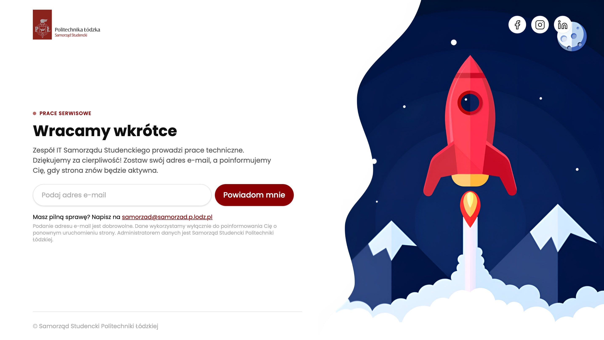

# 🛠️ SSPŁ — In-Progress Page

Strona tymczasowa używana jako **placeholder** dla witryn Samorządu Studenckiego PŁ, które są aktualnie w trakcie prac technicznych lub oczekują na wdrożenie.

Umożliwia użytkownikowi pozostawienie adresu e-mail, który zostanie zapisany w bazie Google Workspace (Apps Script). Po uruchomieniu docelowej strony wysyłane jest powiadomienie o dostępności serwisu.



---

## 🚀 Funkcje

- 🔧 Prosty, lekki **frontend w React + Bun + TailwindCSS**
- 📬 Formularz zapisu z walidacją (`zod`) i honeypotem anty-spam
- 🔒 Minimalne przetwarzanie danych (RODO-friendly)
- ⚡️ API proxy w Bun (bezpośrednie połączenie z Google Apps Script)
- 🌐 Dynamiczne dane z `.env` (tytuł, opis, endpoint)

---

## 📦 Instalacja, konfiguracja i uruchomienie

1. Instalacja zależności:

```bash
bun install
```

2. Konfiguracja środowiska:

Utwórz plik `.env.local` na podstawie `.env.example` i uzupełnij zmienne środowiskowe.

> ℹ️ Zmienne z prefiksem BUN_PUBLIC są dostępne w przeglądarce (frontend). Pozostałe są tylko po stronie serwera (backend).

1. Uruchomienie aplikacji:

- w trybie deweloperskim:

```bash
bun dev
```

- w trybie produkcyjnym:

```bash
bun start
```

## 🔐 Ochrona danych (RODO)

🧾 Treść informacyjna do wyświetlenia pod formularzem:

Podanie adresu e-mail jest dobrowolne. Dane wykorzystamy wyłącznie do poinformowania Cię o ponownym uruchomieniu strony. Administratorem danych jest Samorząd Studencki Politechniki Łódzkiej.

---

This project was created using `bun init` in bun v1.3.0. [Bun](https://bun.com) is a fast all-in-one JavaScript runtime.
